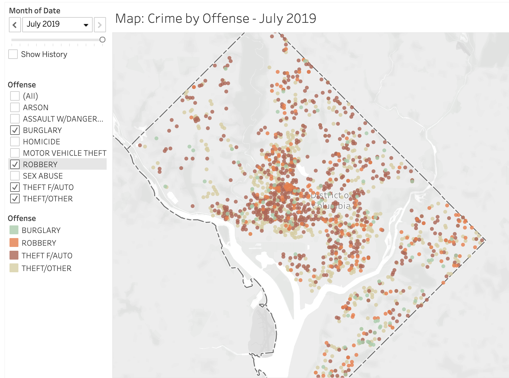

# Washington, DC Crime Analysis & Predictive Modeling

     

## Project Overview
The intent for this project was two-fold: 

**Part One** - Involved exploratory data analysis of crime incidents throughout Washington, DC from July 2018 - 2019. The analysis will involve mappings of crime incidents within the city, crime volumes by certain time and day parameters, as well as crime incidents by geographical dimensions, i.e., DC Wards. 

**Part Two** - Involves an attempt to classify the **type** of crime to have taken place given a number of feature variables. The DC Police Department recognizes crime as belonging to one of the following classes:
- Arson
- Assault with A Dangerous Weapon
- Burglary
- Homicide
- Motor Vehicle Theft
- Robbery
- Sex Abuse
- Theft From Automobiles
- Theft (Other)

The modeling portion will focus on identifying the best algorithm to classify the type of crime that took place. The problem we're trying to solve is whether or not a model can predict the type of crime with a reasonable degree of accuracy using the data from the DC Police Department. The implications of a successful model could feasibly assist the police department with allocating the appropriate resources as soon as as soon as a crime was to occur in an effort to mobilize the appropriate resources ahead of time in an attempt to detain the perpetrator.

For both parts, we'll walk through the highlights as well as the methods used for obtaining, cleaning, analyzing, conditioning, feature engineering, and modeling the data.

**Key Technologies & Python Libraries Used:**
 - Folium (mapping)
 - SKlearn
 - Seaborn
 - Tableau (interactive visualizations)
     - Direct link to Tableau public profile housing many of the Tableau graphics used throughout this project: https://public.tableau.com/profile/jonathan.ericksen5220#!/

***

## Obtaining the Data

The crime data for this project was obtained through the Open Data DC platform maintained by the DC government: https://opendata.dc.gov. The particular dataset used is available for download via the following URL: https://opendata.dc.gov/datasets/crime-incidents-in-2019. 

Crime data was extracted for both 2018 and 2019. Both raw datasets can be found in the project repository titled: 'Crime_Incidents_in_2018.csv' & 'Crime_Incidents_in_2019.csv'.

***

## Data Cleaning

The data cleaning process was fairly straight forward as the datasets themselves are well kept and relatively clean. The 2018 dataset contained 33,782 crime instances, while the 2019 dataset at the time of download contained 20,620 crime instances.

The image below highlights the features contained within these crime datasets:

     

### Data Cleaning Highlights

**Initial Features Removed** 

The following features were removed due to their ambiguity, redundancy with other features, containing too many missing values, or irrelevance to the problem being solved:

- 'X' 
- 'Y'
- 'CCN'
- 'BLOCK'
- 'XBLOCK'
- 'YBLOCK' 
- 'ANC' 
- 'PSA'
- 'BID' 
- 'START_DATE'
- 'END_DATE'

**Features Split for Modeling Purposes** 

The following features were split into their component parts for visualization purposes, i.e., 'DATE' --> 'DAY, 'MONTH', 'YEAR'): 

- 'DATE'
- 'TIME'

**Features Added**

The following features were added for visualization purposes:

- 'COUNT' (for summing crime events) 
- 'CITY' (for mapping purposes)

**Missing Values** 

The remaining dataset contained missing values within some of the feature variables. The percentage of missing values within these features with respect to the total dataset was assessed and deemed insignificant enough to comfortably remove these rows altogether. 

Below is the features containing missing values: 

     

***

## Exploratory Data Analysis

The exploratory phase focused on two key themes: DC crime by geographical location, and crime by date and time parameters. Additionally, we took a look at the overall breakdown of total crimes committed by crime type. 

### Total Crime by Offense

To start, we offer a graphic that highlights the total crime committed in DC from July '18 - '19. The graphic breaks down the crime counts by the type of crime committed:  

     

### Month, Weekday, Hour Analysis

For this section, we illustrate total crime volumes by the month, weekday, and hour to assess any cyclical patterns based on time & day dimensions.

**Total Crime Incidents by Month**

Here, we extracted total crime incidents by month to highlight any seasonality among total crime volumes: 

     

From the data there appears to be a fairly significant seasonal effect with respect to total crime volumes in DC. The delta between the months of August (peak) and February (bottom) represents a ~31% drop in total crimes committed. 

Note: A portion of the variation between months can be explained by the total number of days in each month, however, the effect of this is relatively insignificant and does not account for the large drop in total crime from August to February. A seasonal cycle likely explains the majority of the variation between August and February. 

**Total Crime Incidents by Weekday**

We then took a look at total crime incidents by weekday extracting the effect, if any, of the weekday on total crime incidents:

     

From the analysis, its clear crime volumes do not vary by weekday in a significant way. A crime appears just as likely to occur a given weekday relative to the rest. 

**Total Crime Incidents by Hour**

Our next two graphics parse the total volume of crime by hour. The goal is to highlight trends that exist in terms of crime volumes within a 24 hour cycle:

     

     

The cyclical nature of crime incidents in DC throughout a 24 hour period are clearly indicated above with the early morning hours seeing minimal crime activity vs. the afternoon and evening hours. 

### Geographic Analysis

This section focused on visualizing crime incidents based upon geographic location. To begin, we visualize the concentrations of crime incidents throughout the city for the one year of July '18 - '19:

     

Further, we produced a graphic that parses out the geographical distribution of crime incidents per month. An interesting animation below samples the changes in crime concentrations per month:

     

Finally, we built a series of heatmaps outlining the distribution of different crime types throughout DC: 

     

**Crime by Ward**

Further analysis was done to compare and contrast crime volumes by DC wards. A map of the DC wards is provided below for easy reference: 

     

Below I provide the analysis of crime by wards which offers total crime volumes & rates:

     

**Crime by Geographic Location**

Finally, we took a look at the exact geographical location of each crime that took place. I built an interactive Tableau visual which allows the user to filter the month and crime time to geo locate each instance. A screenshot is provided below:

     

Here's a direct link to interactive graphic via Tableau public: https://public.tableau.com/profile/jonathan.ericksen5220#!/vizhome/IncidentMap_15686551429520/MapCrimebyOffense

***

## Modeling

The modeling portion of this project included a number of steps taken to further prepare the data for modeling The highlights of these steps are included in the sections below. Following the additional data processing, we'll outline the results of our final model. 

### Conditioning

The additional steps for conditioning the data included the following: 

- Split the features 'NEIGHBORHOOD_CLUSTER' and 'VOTING_PRECINCT' from their string counterparts within each instance. Once complete, we removed the string components leaving just the numeric values for the features. The below image highlights the features addressed in this step: 

     

- Removed empty spaces from the 'BLOCK_GROUP' feature. 
- Converted all features assigned the wrong data type to integer or float data types. 

### Feature Engineering

The additional steps for engineering our features included the following: 

- The 'DATE' and 'TIME' features were split into their component parts as seen below:

     

                    

     

 

- Features 'SHIFT' and 'METHOD' were categorical variables which required dummification via one-hot-encoding:

     

    
- Data rebalancing via the SMOTE method was necessary due to class imbalances as seen below:

     

    
- Rescaling the feature variables was the final engineering step. Doing so ensures no single feature has an outsized impact on model performances:

     

     
### Model Selection

With our data conditioned, features engineered for modeling and our class labels encoded, the data was ready for modeling. We began the modeling portion by instantiating the following classifiers for side by side performance evaluation using each model's default hyperparameters: 

- K Nearest Neighbors
- Decision Trees
- Naive Bayes
- Random Forests
- Ada Boost

The models were run using a training set containing ~167k instances from our rebalanced data. The dataset was split 20 times using Kfold and assessed against the training labels using the scoring metric 'Accuracy'. We then plotted the mean and standard deviation of the 20 training instance's cross validation scores. Below we include the results of our initial model comparisons: 

     

With the resulting model performances above, I chose to proceed using the random forest classifier as it's average accuracy performance was the highest at ~82%. 

The next step was to improve the existing random forest model by running SKlearn's GridSearchCV on a number of test input hyperparameters. By doing so, we extracted the best hyperparameters resulting in an improved accuracy score of ~85%. 

### Model Evaluation, Analysis & Improvements

The following includes steps taken to assess and improve the initial model's performance. 

**Feature Elimination**

After review of the contributing feature variables, the decision was made to remove the 'SECOND' and 'MINUTE' dimensions as such granular data regarding the exact timing of a crime is likely prone to error or human influence. The resulting feature set includes 19 dimensions.

**Feature Importance**

I visualized the features importances from the initial model ranking the dimensions by their relative importance. Doing so extracted the top contributing features:

     

**Confusion Matrix**

I then assessed the initial model's confusion matrix which highlighted areas of high misclassification. The image below depicts a high level of misclassification between classes 7 & 8 which will be the subject of further investigation below:

     

**Performance Analysis & Investigation**

The resulting confusion matrix indicates a high level of misclassification between class 7 & 8. These classes represent theft from automobiles and theft classified as 'other'. For both classes, minor theft is the underlying theme. 

Efforts were made to look at the underlying data from the top three contributing features to assess existing similarities in the underlying data - high levels of similarity could lead to a model's inability to differentiate between classes. 

Beginning with the most important feature, I looked at the distribution of 'hour' data for class 7 & 8 and compared it the distribution of the relatively unrelated crime classes 1 & 4: 

     

     

The distributions for classes 7 & 8 showed significant similarities when compared to classes 1 & 4. These similarities provide  evidence that perhaps the hour feature is difficult for the model to differentiate between the minor theft classes leading to the higher levels of misclassification between the classes. 

I performed a similar analysis with the 2nd and 3rd most important features (latitude and longitude) and found class 7 & 8 exhibited similar distributions with respect to classes 1 and 4.

**Final Model**

Based on the above analysis, and due to the similar nature of class 7 & 8 with respect to the type of crime, the decision was made to combine these classes into one and reassess the model's performance. Doing so increased the models accuracy score to **~89%**. The resulting confusion matrix is provided below:

     

***

## Conclusion

This project includes more than was highlighted in the README above. The additional contents can be found in the accompanying jupyter notebooks contained within the project repository. However, we've captured the project highlights above and offer the following concluding remarks: 

The data analysis more or less speaks for itself. Throughout the project, we provided insights into some elements of criminal behavior within the District of Columbia. We looked at geographical crime distributions as well as distributions among certain time parameters.

The modeling portion, and its implications, require further investigation and work to improve the overall performance. We were able to successfully massage and model using the existing data producing a crime classification model yielding a ~89% accuracy score. The logical next step is to further iterate on the existing model hyperparameters and features in an attempt to further improve its performance. 

**Further Work**

Though our model returned an ~89% accuracy score, more work is needed to improve the performance before any real world application of this model would suffice. Below I offer recommendations for further work in an attempt to achieve a better model performance: 

- ***More Features***: Acquire additional data containing features such as school districts, mass transit station station stops, socioeconomic data, et cetera. These additional features, along with many potential others, may contain predictive information that might contribute to better model performance. 
- ***More Training Data***: For this project, we trained our model using 2018 and 2019 YTD crime data. Further attempts to improve the model should include fitting the parameters using data from multiple years. Doing so is costly in terms of processing power and time, but the improvements in accuracy may be worth the effort. 
- ***Additional Classifiers***: Although we employed 5 algorithms adept at classification problems, more classifiers exist. I'd recommend testing additional, perhaps less popular, classifying algorithms to rule out Random Forests as our peak performer given these data.
- ***Additional Model Assessment***: Further work is needed to assess the causes of misclassification between class 7 (minor theft) and classes 2, 4, and 5 (burglary, motor vehicle theft, and robbery). These crimes, given their close common them with minor theft, likely contain features with high similarly high correlations (as in the case of hour data for class 7 & 8) causing the model to misclassify the crime types. More investigation is needed to extract and control for these similarities as was done between the two minor theft classes. 

